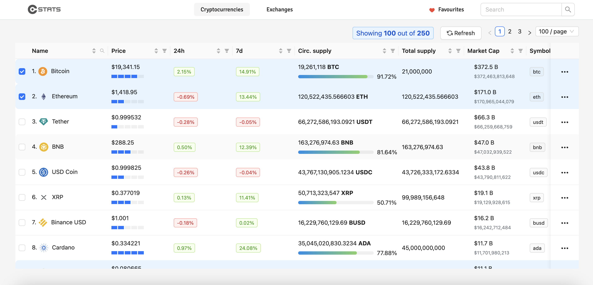
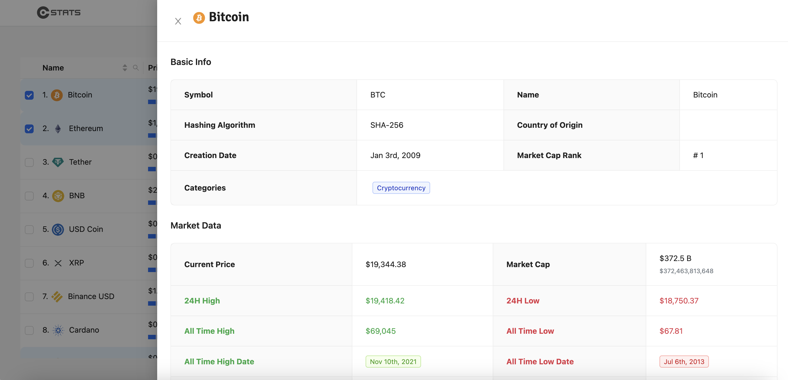
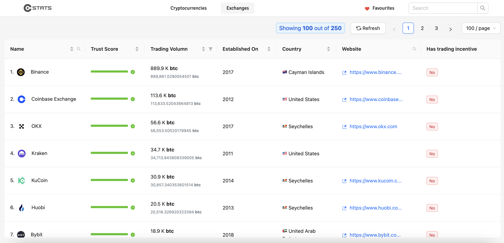

# Catalogue of Statistics

> Crypto Stats is an app to view crypto currency data. Currently there is no data refresh but that is a feature to be implemented later on in the project.

## Built With

- React
- Javascript

## Live Demo

[click to view a live demo of the project](https://cryptocurrencies-stat.herokuapp.com/)

## Setup

make sure nodejs & npm is installed in your machine

- clone the repository `git clone https://github.com/misterpaul4/crypto-stats`
- install dependecies `npm install`
- start the server `npm start`

## Test

To run tests, run `npm test`. Make sure the dependencies installed successfully before running tests

## Authors

👤 Paul

- Github: [@misterpaul4](https://github.com/misterpaul4)
- Linkedin: [Chukwuebuka Paul Ajuizeogu](https://www.linkedin.com/in/chukwuebuka-paul-ajuizeogu/)

## 🤝 Contributing

Contributions, issues and feature requests are welcome!

Feel free to check the [issues page](issues/).

## Show your support

Give a ⭐️ if you like this project!

## Acknowledgments

- [coingecko](https://www.coingecko.com/en)
- [ant design](https://ant.design/)

## 📝 License

This project is [MIT](lic.url) licensed.
